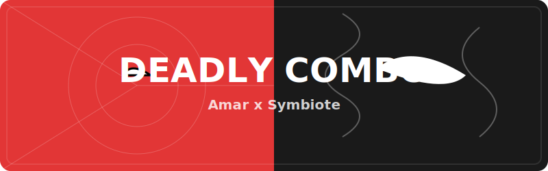

 

<table width="100%" border="0">
  <tr>
    <td width="25%" align="center">
      
    </td>
    <td width="75%" align="center">
      
       
      

        
      

    </td>
  </tr>
</table>

---

### 🕸️ The Deadly Desk

  
   
  
   
  

---

### 👋 Ethereal Vibes from Amar

I build <b>digital harmonies</b> with the power of the symbiote and the agility of a spider. My code is a deadly mix of technical precision and spectacular flow.

> **“ सर्वे भवन्तु सुखिनः सर्वे सन्तु निरामयाः "**  
> *(May all beings be peaceful and free from suffering)*

- 🎹 **PhiloMusic**: Crafting tools at the intersection of music and code.
- 🕷️ **Deadly Architect**: Solving problems with great responsibility and savage power.
- 🕉️ **Balance**: Engineering with soul.

---

### 🛠️ The Tech Orchestra

  
  
  
  

---

### 🚀 Spectacular Works

| 🎵 Project | Description | Theme |
| :--- | :--- | :--- |
| **[PhiloMusic](https://github.com/amarhoonbhai/PhiloMusic)** | Melodic engineering & analysis tools. | Music |

---

